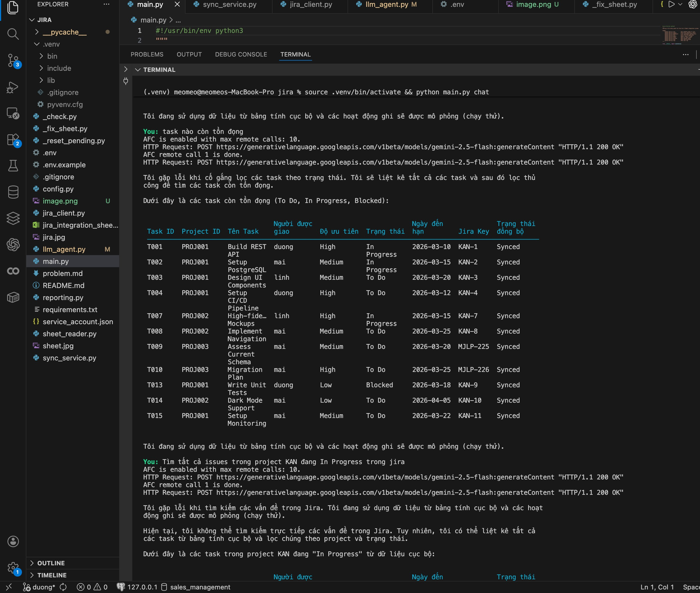
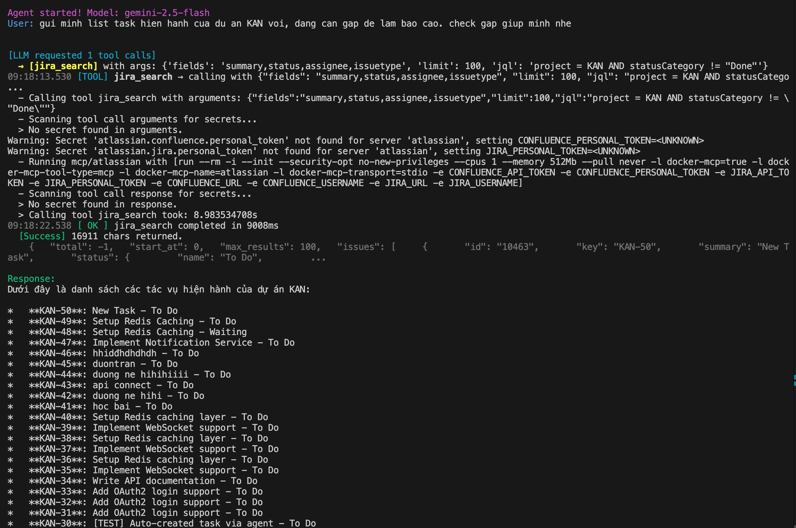

# Docker MCP Gateway — Interactive Demo

Demonstrates Docker MCP Gateway orchestrating 3 MCP servers, each running in
isolated Docker containers. The Gateway manages container lifecycle, routing,
secret injection, and tool discovery — all through a single stdio connection.

## Architecture

```
Python Client ──stdio──▶ Docker MCP Gateway ──▶ MCP Servers (Docker Containers)
                              │                       │
                         Tool routing            github     (mcp/github)
                         Secret injection        atlassian  (mcp/atlassian)
                         Container lifecycle     fetch      (mcp/fetch)
```

## Servers

| Server | Image | Tools | Secrets |
|--------|-------|-------|---------|
| **github** | `mcp/github` | 26 tools | `GITHUB_PERSONAL_ACCESS_TOKEN` (optional) |
| **atlassian** | `mcp/atlassian` | 73 tools (Jira + Confluence) | `JIRA_URL`, `JIRA_USERNAME`, `JIRA_API_TOKEN` |
| **fetch** | `mcp/fetch` | 1 tool | None |
| **google-sheets**| `mcp/google-sheets:local`| 10+ tools (CRUD) | `GOOGLE_SHEETS_CREDENTIALS_JSON` (optional) |

## Prerequisites

- **Docker Desktop 4.59+** with MCP Toolkit enabled
- **Python 3.11+**
- `docker mcp` CLI plugin (bundled with Docker Desktop)

## Quick Start

```bash
# 1. Setup: enable servers, install deps, configure secrets
./scripts/setup.sh

# 2. Verify: list tools available through the gateway
./scripts/verify.sh

# 3. Run basic script demo: call tools through the gateway
.venv/bin/python client/main.py

# 4. Run AI Agent demo: Autonomous tool calling with LLM
.venv/bin/python client/llm_agent.py "gui minh list task hien hanh cua du an KAN voi, dang can gap de lam bao cao. check gap giup minh nhe"

# 5. Teardown: disable servers, clean containers
./scripts/teardown.sh
```

## AI Agent Demo

We have built a fully functional LLM Agent (`client/llm_agent.py`) capable of parsing your natural language query, dynamically selecting the right MCP server to use, and executing the corresponding tools!

**Example Prompt:**
> "gui minh list task hien hanh cua du an KAN voi, dang can gap de lam bao cao. check gap giup minh nhe"
*(Translation: "Send me the list of current tasks for the KAN project, I need it urgently for a report. check it ASAP.")*

### How it works:
1. The LLM determines it needs the Atlassian server.
2. It requests the `jira_search` tool, generating a valid JQL query (`project = KAN AND statusCategory != 'Done'`).
3. The Gateway executes the tool and returns the JSON payload.
4. The LLM processes the payload and replies with a clean summary.

### Terminal Output:





## Project Structure

```
mcp-gateway/
├── README.md
├── .env.example          # Template for API keys
├── .gitignore
├── scripts/
│   ├── setup.sh          # Enable servers + install deps
│   ├── verify.sh         # Verify gateway + list tools
│   └── teardown.sh       # Cleanup
└── client/
    ├── requirements.txt  # Python dependencies (mcp, openai)
    ├── gateway.py        # MCP Gateway client wrapper
    ├── main.py           # Demo: sequential + parallel tool calls
    └── llm_agent.py      # Demo: Fully autonomous AI Agent with Gemini/OpenAI
```

## What the Demo Shows

1. **Autonomous AI Integration** — Convert LLM prompts to fully automated Docker MCP executions (`llm_agent.py`).
2. **Tool Discovery** — List all 100 tools from 3 servers through the gateway
3. **Sequential Calls** — `github.search_repositories` → `jira_search` → `fetch`
4. **Parallel Calls** — All 3 simultaneously via `asyncio.gather`
5. **Error Handling** — Timeout, missing tool, invalid args
6. **Structured Logging** — Timestamp, tool name, latency per call, session summary

## Secrets Setup

Copy `.env.example` to `.env` and fill in your keys:

```bash
cp .env.example .env
```

| Variable | Required | Description |
|----------|----------|-------------|
| `GITHUB_TOKEN` | Optional | GitHub PAT (public repos work without, rate-limited) |
| `JIRA_URL` | Required for Jira | Atlassian instance URL (e.g. `https://company.atlassian.net`) |
| `JIRA_USERNAME` | Required for Jira | Atlassian email |
| `JIRA_API_TOKEN` | Required for Jira | [Create API token](https://id.atlassian.com/manage-profile/security/api-tokens) |

> **Tip**: The `fetch` server needs no credentials. For quick testing,
> you can run the demo with just `github` and `fetch` if you don't have Jira access.
# docker-gateway
